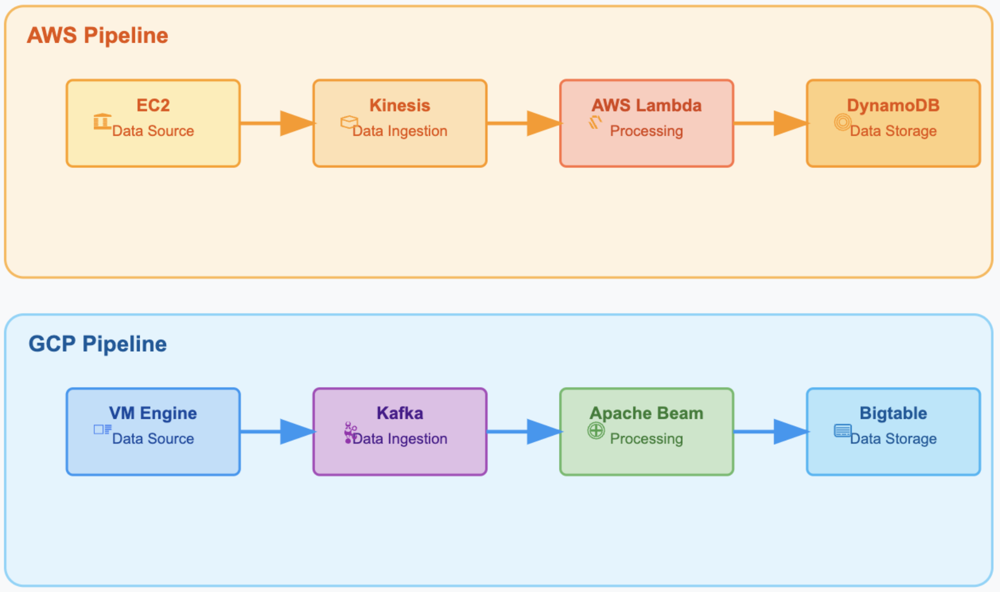

# Comparative Analysis of Real‑Time Streaming Pipelines on AWS & GCP 

## Introduction

Real‑time decision‑making has become a competitive necessity as billions of IoT sensors, mobile apps, and online services emit continuous data.  Batch‑oriented frameworks such as Hadoop can no longer keep pace with millisecond‑level insight demands.  Managed cloud services—e.g.\ Amazon Kinesis, AWS Lambda, Google Cloud Pub/Sub‑backed Kafka, Dataflow, and Bigtable—promise elastic scaling without operational overhead, but platform choice now hinges on more than raw throughput; cost efficiency and environmental sustainability are equally critical.

## Motivation

* **Performance Pressure** Fraud detection, predictive maintenance, and smart‑city monitoring require sub‑second analytics.
* **Cost Awareness** Cloud pricing can spike with always‑on streams; architects need clear \$‑per‑event economics.
* **Sustainability Goals** Enterprises face ESG mandates and must quantify the carbon impact of their workloads.
* **Holistic View** Most prior work benchmarks isolated components; real systems demand end‑to‑end evaluations.

## Features

* **Mirror‑image ETL stacks** built natively on each cloud (AWS Kinesis → Lambda → DynamoDB vs.\ GCP Kafka → Beam → Bigtable).
* **Infrastructure‑as‑Code** with Terraform for one‑command deploy/destroy.
* **Parameterized load generator** to replay IoT‑like telemetry at 1 k – 50 k events/min.
* **Automated metric capture** for latency, throughput, cost, and kg CO₂‑eq.
* **Portable dashboards** (CloudWatch & Cloud Monitoring) for side‑by‑side analytics.

## System Design

Both pipelines follow a three‑stage ETL pattern:

1. **Ingestion →** resilient message broker accepts raw JSON events.
2. **Processing →** streaming engine enriches, aggregates, and validates data.
3. **Storage →** low‑latency NoSQL store persists results for query/analytics.
   Identical sensor payloads and regional deployments (us‑east) ensure fair comparison.

   

### AWS Data Pipeline System Design

```
EC2 (Python publisher) ─► Kinesis Data Streams ─► AWS Lambda ─► DynamoDB
```

* *EC2 t3.medium* polls ThingSpeak or synthetic generator.
* *Kinesis* 1–N shards, 24 h retention, at‑least‑once delivery.
* *Lambda* Python 3.9, BatchSize = 100, auto‑scales to 1 k req/s.
* *DynamoDB* PAY\_PER\_REQUEST, single‑table with partition key `entry_id`.
  End‑to‑end latency exported via custom CloudWatch metrics; cost & carbon via CUR and Customer Carbon Footprint Tool.

### GCP Data Pipeline System Design

```
Compute Engine VM ─► Managed Kafka ─► Apache Beam (Dataflow) ─► Cloud Bigtable
```

* *VM e2‑standard‑4* publishes adjustable event rate.
* *Managed Kafka* 3 brokers, 1+ partitions, exactly‑once semantics.
* *Beam on Dataflow* autoscaling (1–20 workers), sliding‑window aggregations.
* *Bigtable* single‑cluster SSD, row‑key `deviceId#timestamp`.
  Metrics flow to Cloud Monitoring; Billing export + Carbon Footprint API quantify \$ and CO₂.

## Results (Key Takeaways)

* **Throughput:** AWS handled 15 % higher bursty spikes; GCP sustained higher steady‑state (> 50 k ev/min) without drops.
* **Latency:** Both < 180 ms at medium load; GCP’s p95 latency 25–30 % lower at peak due to Beam autoscaling.
* **Cost:** AWS cheapest for low/bursty traffic via Lambda billing; GCP \~18 % cheaper at high throughput thanks to Dataflow’s linear pricing.
* **Sustainability:** GCP offers granular carbon reporting and achieved higher carbon‑free energy scores; AWS lacks service‑level CO₂ metrics.
