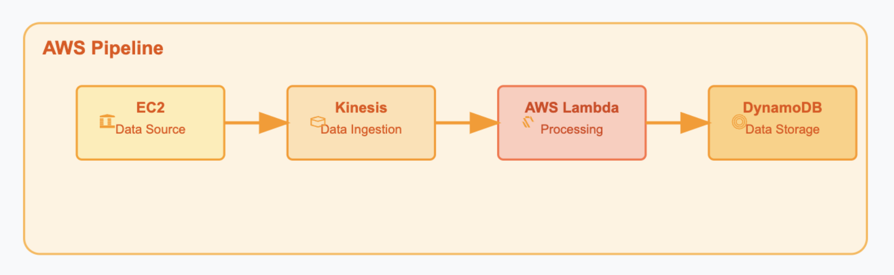

# About

This project implements a real-time data pipeline using AWS services to simulate and process IoT sensor data. The architecture consists of an EC2 instance for data generation, Amazon Kinesis for streaming ingestion, AWS Lambda for data transformation, and DynamoDB for scalable storage. The pipeline is fully automated using Terraform, enabling repeatable infrastructure setup and teardown. This setup is designed for benchmarking performance, cost, and sustainability in cloud-native stream processing.


# AWS Resources Summary

This table outlines the AWS resources created in Terraform.

| **Category** | **Resource Type** | **Name** | **Key Specifications** |
|--------------|-------------------|----------|--------------------------|
| **IAM** | `aws_iam_role` | `ec2_kinesis_role` | Trust: EC2, Role for EC2 to write to Kinesis |
| | `aws_iam_policy` | `ec2_kinesis_write_policy` | Allows: `PutRecord`, `PutRecords`, `DescribeStream` on Kinesis |
| | `aws_iam_role_policy_attachment` | `ec2_kinesis_policy_attach` | Attaches above policy to `ec2_kinesis_role` |
| | `aws_iam_instance_profile` | `ec2_instance_profile` | Used by EC2, wraps `ec2_kinesis_role` |
| | `aws_iam_role` | `lambda_role` | Trust: Lambda, Role for Lambda to read from Kinesis and write to DynamoDB |
| | `aws_iam_role_policy` | `lambda_policy` | Allows Kinesis read, DynamoDB write, CloudWatch logging |
| **Security** | `aws_security_group` | `allow_ssh_and_https` | Ingress: 22 (SSH), 443 (HTTPS); Egress: all |
| **EC2** | `aws_instance` | `iot_data_source` | AMI: Amazon Linux 2, Type: `t2.micro`, IAM: `ec2_instance_profile`, runs `data_source.py` |
| **Kinesis** | `aws_kinesis_stream` | `data_ingestion_stream` | Shards: 1, Retention: 24 hours |
| **Lambda** | `aws_lambda_function` | `data_processing_lambda` | Runtime: Python 3.9, Handler: `lambda_function.lambda_handler`, Env: DynamoDB table |
| | `aws_lambda_event_source_mapping` | `kinesis_trigger` | Triggers Lambda on new Kinesis records (LATEST), Batch size: 100 |
| **DynamoDB** | `aws_dynamodb_table` | `data_storage` | Name: `data-storage-dynamodb`, Key: `entry_id (N)`, Mode: PAY_PER_REQUEST |


# How to Set Up Environment in AWS

## Step 1: Create an AWS Account
- Sign up or log in at [https://aws.amazon.com](https://aws.amazon.com)

## Step 2: Set Region
- Ensure you're operating in the **`us-east-1`** region.
- This pipeline is designed for `us-east-1`.


## Step 3: Create IAM Role for EC2

1. Go to **IAM > Roles**
2. Click **Create Role**
3. Choose **AWS Service** → **EC2**
4. Attach the **AdministratorAccess** policy
5. Set the Role Name: `EC2-terraform-management`
6. Complete role creation


## Step 4: Launch EC2 Instance

- Use default settings (Amazon Linux 2 preferred)
- **Allow HTTP & HTTPS traffic** from the internet
- **No key-pair** required
- In **Advanced Settings**, attach the IAM Role: `EC2-terraform-management`
- Launch the instance


## Step 5: Connect to EC2

- Use **EC2 Instance Connect** from the AWS Console
- This opens a web-based shell into your EC2


## Step 6: Set Up Required Dependencies

Run the following commands in the EC2 shell:

```bash
sudo yum update -y
sudo yum install git -y
sudo yum install -y yum-utils
sudo yum-config-manager --add-repo https://rpm.releases.hashicorp.com/AmazonLinux/hashicorp.repo
sudo yum install -y terraform
sudo yum install python3-pip -y
sudo pip3 install boto3
```

## Step 7: Run Terraform Script to setup the pipeline

Run the following commands in the EC2 shell:

```bash
git clone https://github.com/SunilKuruba/aws-vs-gcp-data-pipeline.git
cd aws-vs-gcp-data-pipeline/aws-data-pipeline/
zip terraform/lambda_function_payload.zip lambda_function.py
cd terraform
terraform init
terraform validate
terraform plan
terraform apply -auto-approve
```

## Step 7: Cleanup Resources once the experiment is complete
Run the following commands in the EC2 shell:

```bash
terraform destroy -auto-approve
```